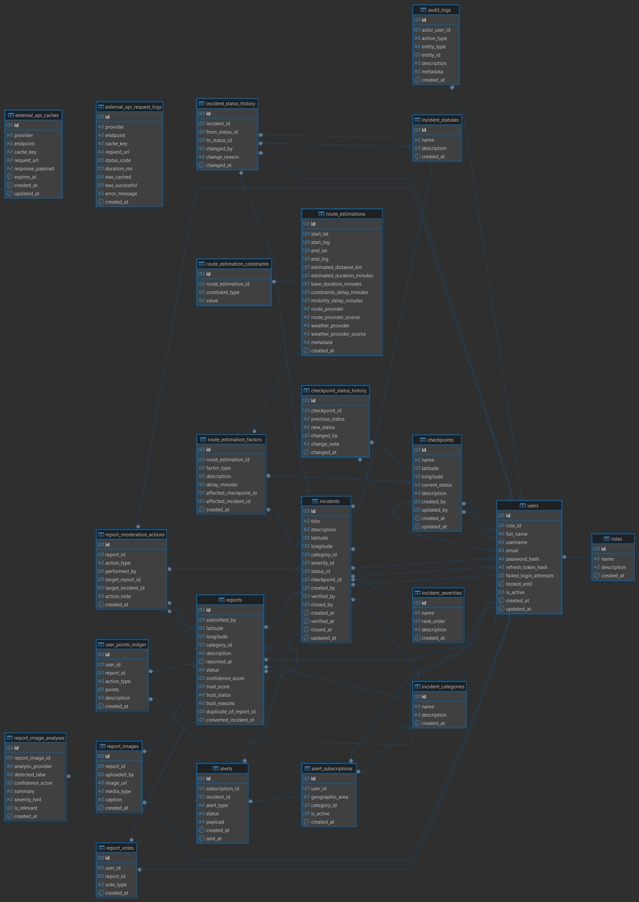

# Wasel Palestine

## System Overview

Wasel Palestine is an API-centric smart mobility platform designed to support Palestinians in navigating daily mobility challenges through structured, reliable, and up-to-date mobility intelligence. The system focuses on backend engineering only and exposes its functionality through versioned REST APIs that can be consumed by mobile applications, web dashboards, or third-party systems.

The platform aggregates and manages:

- checkpoints and checkpoint status history
- road incidents and incident lifecycle management
- crowdsourced citizen reports with moderation, trust scoring, image analysis, and gamification
- route estimation and mobility intelligence
- alerts and regional notifications
- external routing, geolocation, and weather intelligence

Core stack:

- `NestJS`
- `TypeORM`
- `MySQL`
- `JWT access + refresh authentication`
- `Docker`
- `k6`

## Architecture Diagram

The project follows a `Modular Monolith Architecture` with internal separation by responsibility:

- `application`
- `domain`
- `infrastructure`

Main modules:

- `auth`
- `checkpoints`
- `incidents`
- `reports`
- `alerts`
- `route-estimation`
- `external-intelligence`
- `reference-data`
- `audit-logs`

High-level flow:

```text
Client
  -> Versioned REST API (/api/v1)
  -> Controllers
  -> Application Services
  -> Domain Services / Policies
  -> Infrastructure Repositories / External API Clients
  -> MySQL + External Providers
```

## Database Schema (ERD)

The database name is:

- `advanced_wasel_palestine`

ERD image:



Database explanation PDF:

- [advanced_wasel_palestine.pdf](./advanced_wasel_palestine.pdf)

Current database coverage includes `23` tables across authentication, incidents, reporting, alerts, route estimation, gamification, image analysis, and external API caching/logging.

Main entity groups:

- Identity and authorization: `roles`, `users`
- Mobility monitoring: `checkpoints`, `checkpoint_status_history`, `incidents`, `incident_status_history`
- Reference data: `incident_categories`, `incident_severities`, `incident_statuses`
- Crowdsourced reporting: `reports`, `report_votes`, `report_moderation_actions`
- AI vision and media support: `report_images`, `report_image_analyses`
- Gamification: `user_points_ledger`
- Alerts: `alert_subscriptions`, `alerts`
- Route intelligence: `route_estimations`, `route_estimation_constraints`, `route_estimation_factors`
- Auditing: `audit_logs`
- External integration support: `external_api_caches`, `external_api_request_logs`

## API Design Rationale

The API is versioned through:

- `/api/v1/...`

Design decisions:

- REST-first design for interoperability and clarity
- feature-oriented modules to keep the codebase maintainable
- role-based authorization for protected actions
- DTO-based validation for request safety
- pagination, sorting, and filtering on read-heavy resources
- hybrid persistence approach:
  - `TypeORM ORM` for entities, relations, writes, and standard application persistence
  - `raw SQL queries` for selected read-heavy and aggregation-heavy endpoints

Examples of resource design:

- `incidents` supports listing, filtering, sorting, verification, and closing
- `reports` supports creation, voting, moderation, image upload, trust scoring, and leaderboard retrieval
- `route-estimation` supports estimation, retrieval, and recalculation
- `alerts` supports subscriptions, alert listing, and state updates

Authentication design:

- `JWT access token`
- `JWT refresh token`
- password hashing with `bcrypt`
- rate limiting and account lock protection

## API Endpoints

Base URL:

- `http://localhost:3000/api/v1`

Swagger:

- `http://localhost:3000/api/docs`

Common headers:

Public JSON header:

```json
{
  "Content-Type": "application/json"
}
```

Protected JSON header:

```json
{
  "Authorization": "Bearer <access_token>",
  "Content-Type": "application/json"
}
```

Role rules:

- `admin`: full administrative access
- `moderator`: moderation and incident management access
- `citizen`: report submission, voting, subscriptions, and read access

### Auth

#### `POST http://localhost:3000/api/v1/auth/register`

Header:

```json
{
  "Content-Type": "application/json"
}
```

Body:

```json
{
  "fullName": "Yasmeen Vision",
  "username": "yasmeen_vision",
  "email": "yasmeen.vision@wasel.ps",
  "password": "StrongPass1",
  "role": "citizen"
}
```

#### `POST http://localhost:3000/api/v1/auth/login`

Header:

```json
{
  "Content-Type": "application/json"
}
```

Body:

```json
{
  "identifier": "amal_admin",
  "password": "StrongPass1"
}
```

#### `POST http://localhost:3000/api/v1/auth/refresh`

Header:

```json
{
  "Content-Type": "application/json"
}
```

Body:

```json
{
  "refreshToken": "<refresh_token>"
}
```

#### `POST http://localhost:3000/api/v1/auth/logout`

Header:

```json
{
  "Content-Type": "application/json"
}
```

Body:

```json
{
  "refreshToken": "<refresh_token>"
}
```

#### `GET http://localhost:3000/api/v1/auth/me`

Header:

```json
{
  "Authorization": "Bearer <access_token>",
  "Content-Type": "application/json"
}
```

Body:

- no body

### Reference Data

#### `GET http://localhost:3000/api/v1/reference-data/incident-categories`
#### `GET http://localhost:3000/api/v1/reference-data/incident-severities`
#### `GET http://localhost:3000/api/v1/reference-data/incident-statuses`
#### `GET http://localhost:3000/api/v1/reference-data/roles`

Header:

```json
{
  "Content-Type": "application/json"
}
```

Body:

- no body

Example IDs used across the system:

```json
{
  "roles": [
    { "id": 1, "name": "admin" },
    { "id": 2, "name": "moderator" },
    { "id": 3, "name": "citizen" }
  ],
  "incidentCategories": [
    { "id": 1, "name": "closure" },
    { "id": 2, "name": "delay" },
    { "id": 3, "name": "accident" },
    { "id": 4, "name": "weather_hazard" }
  ],
  "incidentSeverities": [
    { "id": 1, "name": "low" },
    { "id": 2, "name": "medium" },
    { "id": 3, "name": "high" },
    { "id": 4, "name": "critical" }
  ],
  "incidentStatuses": [
    { "id": 1, "name": "pending" },
    { "id": 2, "name": "active" },
    { "id": 3, "name": "verified" },
    { "id": 4, "name": "closed" },
    { "id": 5, "name": "rejected" }
  ]
}
```

### Checkpoints

#### `GET http://localhost:3000/api/v1/checkpoints`

Header:

```json
{
  "Content-Type": "application/json"
}
```

Query example:

- `?page=1&limit=10&status=active&search=Ramallah`

Body:

- no body

#### `GET http://localhost:3000/api/v1/checkpoints/:id`

Example:

- `http://localhost:3000/api/v1/checkpoints/1`

Header:

```json
{
  "Content-Type": "application/json"
}
```

Body:

- no body

#### `POST http://localhost:3000/api/v1/checkpoints`

Roles:

- `admin`
- `moderator`

Header:

```json
{
  "Authorization": "Bearer <admin_or_moderator_access_token>",
  "Content-Type": "application/json"
}
```

Body:

```json
{
  "name": "Huwara Checkpoint - Nablus",
  "latitude": 32.1644,
  "longitude": 35.2829,
  "currentStatus": "active",
  "description": "Main checkpoint south of Nablus."
}
```

#### `PATCH http://localhost:3000/api/v1/checkpoints/:id`

Example:

- `http://localhost:3000/api/v1/checkpoints/1`

Header:

```json
{
  "Authorization": "Bearer <admin_or_moderator_access_token>",
  "Content-Type": "application/json"
}
```

Body:

```json
{
  "currentStatus": "restricted",
  "description": "Traffic movement partially restricted."
}
```

#### `GET http://localhost:3000/api/v1/checkpoints/:id/status-history`

Example:

- `http://localhost:3000/api/v1/checkpoints/1/status-history`

Header:

```json
{
  "Content-Type": "application/json"
}
```

Body:

- no body

#### `POST http://localhost:3000/api/v1/checkpoints/:id/status-history`

Roles:

- `admin`
- `moderator`

Header:

```json
{
  "Authorization": "Bearer <admin_or_moderator_access_token>",
  "Content-Type": "application/json"
}
```

Body:

```json
{
  "newStatus": "active",
  "changeNote": "Updated after field verification."
}
```

### Incidents

#### `GET http://localhost:3000/api/v1/incidents`

Header:

```json
{
  "Content-Type": "application/json"
}
```

Query example:

- `?page=1&limit=10&categoryId=2&severityId=2&statusId=3&checkpointId=2&search=Ramallah`

Body:

- no body

#### `GET http://localhost:3000/api/v1/incidents/:id`

Example:

- `http://localhost:3000/api/v1/incidents/2`

Header:

```json
{
  "Content-Type": "application/json"
}
```

Body:

- no body

#### `POST http://localhost:3000/api/v1/incidents`

Roles:

- `admin`
- `moderator`

Header:

```json
{
  "Authorization": "Bearer <admin_or_moderator_access_token>",
  "Content-Type": "application/json"
}
```

Body:

```json
{
  "title": "Heavy delay north of Ramallah",
  "description": "Long vehicle queue near Beit El Junction Checkpoint.",
  "latitude": 31.9405,
  "longitude": 35.211,
  "categoryId": 2,
  "severityId": 2,
  "checkpointId": 2
}
```

#### `PATCH http://localhost:3000/api/v1/incidents/:id`

Example:

- `http://localhost:3000/api/v1/incidents/2`

Header:

```json
{
  "Authorization": "Bearer <admin_or_moderator_access_token>",
  "Content-Type": "application/json"
}
```

Body:

```json
{
  "description": "Delay eased slightly but congestion still exists.",
  "severityId": 2
}
```

#### `POST http://localhost:3000/api/v1/incidents/:id/verify`

Roles:

- `admin`
- `moderator`

Header:

```json
{
  "Authorization": "Bearer <admin_or_moderator_access_token>",
  "Content-Type": "application/json"
}
```

Body:

```json
{
  "changeReason": "Verified by moderator Lana."
}
```

#### `POST http://localhost:3000/api/v1/incidents/:id/close`

Roles:

- `admin`
- `moderator`

Header:

```json
{
  "Authorization": "Bearer <admin_or_moderator_access_token>",
  "Content-Type": "application/json"
}
```

Body:

```json
{
  "changeReason": "Checkpoint reopened and road cleared."
}
```

#### `GET http://localhost:3000/api/v1/incidents/:id/status-history`

Example:

- `http://localhost:3000/api/v1/incidents/2/status-history`

Header:

```json
{
  "Content-Type": "application/json"
}
```

Body:

- no body

### Reports

#### `GET http://localhost:3000/api/v1/reports`

Roles:

- `admin`
- `moderator`
- `citizen`

Header:

```json
{
  "Authorization": "Bearer <access_token>",
  "Content-Type": "application/json"
}
```

Query example:

- `?page=1&limit=10&status=approved&categoryId=1&trustStatus=needs_review&minTrustScore=40`

Body:

- no body

#### `GET http://localhost:3000/api/v1/reports/top-contributors`

Header:

```json
{
  "Authorization": "Bearer <access_token>",
  "Content-Type": "application/json"
}
```

Query example:

- `?limit=10`

Body:

- no body

#### `GET http://localhost:3000/api/v1/reports/:id`

Example:

- `http://localhost:3000/api/v1/reports/1`

Header:

```json
{
  "Authorization": "Bearer <access_token>",
  "Content-Type": "application/json"
}
```

Body:

- no body

#### `POST http://localhost:3000/api/v1/reports`

Header:

```json
{
  "Authorization": "Bearer <access_token>",
  "Content-Type": "application/json"
}
```

Body:

```json
{
  "latitude": 32.1677,
  "longitude": 35.2834,
  "categoryId": 1,
  "description": "Checkpoint traffic is almost stopped near Huwara and vehicles are barely moving.",
  "reportedAt": "2026-04-12T10:30:00.000Z"
}
```

#### `POST http://localhost:3000/api/v1/reports/:id/votes`

Header:

```json
{
  "Authorization": "Bearer <access_token>",
  "Content-Type": "application/json"
}
```

Body:

```json
{
  "voteType": "confirm"
}
```

#### `GET http://localhost:3000/api/v1/reports/:id/votes`

Roles:

- `admin`
- `moderator`

Header:

```json
{
  "Authorization": "Bearer <admin_or_moderator_access_token>",
  "Content-Type": "application/json"
}
```

Body:

- no body

#### `GET http://localhost:3000/api/v1/reports/:id/images`

Header:

```json
{
  "Authorization": "Bearer <access_token>",
  "Content-Type": "application/json"
}
```

Body:

- no body

#### `POST http://localhost:3000/api/v1/reports/:id/images`

Header:

```json
{
  "Authorization": "Bearer <access_token>",
  "Content-Type": "application/json"
}
```

Body:

```json
{
  "imageUrl": "https://assets.wasel.ps/uploads/nablus_broken_vehicle_accident.jpg",
  "mediaType": "accident",
  "caption": "Broken vehicle near Nablus city entrance."
}
```

#### `GET http://localhost:3000/api/v1/reports/:id/moderation-actions`

Roles:

- `admin`
- `moderator`

Header:

```json
{
  "Authorization": "Bearer <admin_or_moderator_access_token>",
  "Content-Type": "application/json"
}
```

Body:

- no body

#### `POST http://localhost:3000/api/v1/reports/:id/approve`

Header:

```json
{
  "Authorization": "Bearer <admin_or_moderator_access_token>",
  "Content-Type": "application/json"
}
```

Body:

```json
{
  "actionNote": "Approved after matching citizen confirmations."
}
```

#### `POST http://localhost:3000/api/v1/reports/:id/reject`

Header:

```json
{
  "Authorization": "Bearer <admin_or_moderator_access_token>",
  "Content-Type": "application/json"
}
```

Body:

```json
{
  "actionNote": "Rejected because no field evidence confirmed the report."
}
```

#### `POST http://localhost:3000/api/v1/reports/:id/flag-abuse`

Header:

```json
{
  "Authorization": "Bearer <admin_or_moderator_access_token>",
  "Content-Type": "application/json"
}
```

Body:

```json
{
  "actionNote": "Suspicious repetition pattern from the same source."
}
```

#### `POST http://localhost:3000/api/v1/reports/:id/merge`

Header:

```json
{
  "Authorization": "Bearer <admin_or_moderator_access_token>",
  "Content-Type": "application/json"
}
```

Body:

```json
{
  "targetReportId": "1",
  "actionNote": "Merged duplicate Huwara closure report."
}
```

#### `POST http://localhost:3000/api/v1/reports/:id/convert-to-incident`

Header:

```json
{
  "Authorization": "Bearer <admin_or_moderator_access_token>",
  "Content-Type": "application/json"
}
```

Body:

```json
{
  "title": "Weather hazard south of Nablus",
  "severityId": 4,
  "checkpointId": 1,
  "actionNote": "Converted to incident after moderator review."
}
```

### Alerts

#### `GET http://localhost:3000/api/v1/alerts/subscriptions`

Header:

```json
{
  "Authorization": "Bearer <access_token>",
  "Content-Type": "application/json"
}
```

Query example:

- `?page=1&limit=10&userId=4&categoryId=1&isActive=true`

Body:

- no body

#### `POST http://localhost:3000/api/v1/alerts/subscriptions`

Header:

```json
{
  "Authorization": "Bearer <access_token>",
  "Content-Type": "application/json"
}
```

Body:

```json
{
  "geographicArea": "circle:32.2211,35.2544,12",
  "categoryId": 1
}
```

#### `PATCH http://localhost:3000/api/v1/alerts/subscriptions/:id`

Header:

```json
{
  "Authorization": "Bearer <access_token>",
  "Content-Type": "application/json"
}
```

Body:

```json
{
  "geographicArea": "circle:31.9038,35.2034,12",
  "categoryId": 2
}
```

#### `POST http://localhost:3000/api/v1/alerts/subscriptions/:id/deactivate`
#### `POST http://localhost:3000/api/v1/alerts/subscriptions/:id/reactivate`

Header:

```json
{
  "Authorization": "Bearer <access_token>",
  "Content-Type": "application/json"
}
```

Body:

- no body

#### `GET http://localhost:3000/api/v1/alerts`

Header:

```json
{
  "Authorization": "Bearer <access_token>",
  "Content-Type": "application/json"
}
```

Query example:

- `?page=1&limit=10&userId=4&status=pending&incidentId=1`

Body:

- no body

#### `POST http://localhost:3000/api/v1/alerts/:id/read`

Header:

```json
{
  "Authorization": "Bearer <access_token>",
  "Content-Type": "application/json"
}
```

Body:

- no body

### Audit Logs

#### `GET http://localhost:3000/api/v1/audit-logs`

Roles:

- `admin`
- `moderator`

Header:

```json
{
  "Authorization": "Bearer <admin_or_moderator_access_token>",
  "Content-Type": "application/json"
}
```

Query example:

- `?page=1&limit=20&actorUserId=2&actionType=approve&entityType=report&entityId=1`

Body:

- no body

### Route Estimation

#### `GET http://localhost:3000/api/v1/route-estimation`

Header:

```json
{
  "Content-Type": "application/json"
}
```

Query example:

- `?page=1&limit=10&factorType=constraint`

Body:

- no body

#### `GET http://localhost:3000/api/v1/route-estimation/:id`

Example:

- `http://localhost:3000/api/v1/route-estimation/4`

Header:

```json
{
  "Content-Type": "application/json"
}
```

Body:

- no body

#### `POST http://localhost:3000/api/v1/route-estimation/estimate`

Header:

```json
{
  "Content-Type": "application/json"
}
```

Body:

```json
{
  "startLat": 32.2211,
  "startLng": 35.2544,
  "endLat": 31.8996,
  "endLng": 35.2042,
  "avoidCheckpoints": true,
  "avoidAreas": ["Huwara", "Beit El"]
}
```

This example estimates a route from `Nablus` to `Ramallah`.

#### `POST http://localhost:3000/api/v1/route-estimation/:id/recalculate`

Example:

- `http://localhost:3000/api/v1/route-estimation/4/recalculate`

Header:

```json
{
  "Content-Type": "application/json"
}
```

Body:

- no body

### External Intelligence

#### `GET http://localhost:3000/api/v1/external-intelligence/geocode/search`

Header:

```json
{
  "Content-Type": "application/json"
}
```

Query example:

- `?query=Nablus`

Body:

- no body

#### `GET http://localhost:3000/api/v1/external-intelligence/weather/current`

Header:

```json
{
  "Content-Type": "application/json"
}
```

Query example:

- `?lat=32.2211&lng=35.2544`

Body:

- no body

## External API Integration Details

The system integrates with at least two external providers:

### 1. OpenRouteService

Used for:

- route directions
- geolocation search

Integrated endpoints:

- `GET /api/v1/external-intelligence/geocode/search`
- `POST /api/v1/route-estimation/estimate`
- `POST /api/v1/route-estimation/:id/recalculate`

### 2. OpenWeatherMap

Used for:

- current weather context for route estimation

Integrated endpoints:

- `GET /api/v1/external-intelligence/weather/current`
- `POST /api/v1/route-estimation/estimate`
- `POST /api/v1/route-estimation/:id/recalculate`

### Integration Controls

The integration layer handles:

- API key based authentication
- timeout policies
- provider-level outgoing rate limiting
- database-backed caching
- request logging
- stale-cache fallback behavior when appropriate

Supporting tables:

- `external_api_caches`
- `external_api_request_logs`

These tables allow the system to reduce repeated calls, improve response stability, and audit external dependency behavior.

## Testing Strategy

Testing in this project focused on:

- functional API verification
- database verification
- external integration verification
- performance and load testing

Functional verification included:

- authentication flow testing
- protected endpoint access validation
- incident and checkpoint workflow validation
- reports, votes, moderation, and trust flow validation
- image analysis and gamification validation
- route estimation validation
- external API endpoint validation

Database verification included:

- checking generated tables
- checking inserted and updated rows
- verifying consistency between API behavior and stored data
- verifying local MySQL state using `mysql.exe`

Performance testing was executed using `k6`.

## Performance Testing Results

Performance and load testing artifacts are available here:

- [performance-report.md](./performance/results/performance-report.md)
- [performance-report.html](./performance/results/performance-report.html)

Executed scenarios:

- read-heavy workload
- write-heavy workload
- mixed workload
- spike testing
- sustained load / soak testing

Reported metrics include:

- average response time
- p95 latency
- throughput
- error rate
- identified bottlenecks

The performance report also includes:

- observed limitations
- root causes
- optimizations applied
- before/after comparison

Summary:

- read-heavy, mixed, spike, and soak scenarios were validated
- optimized results reduced critical error rates significantly
- the system behavior under throttling and write pressure was analyzed and documented

## Deployment

Docker is used for deployment.

Main runtime endpoints:

- API: `http://localhost:3000`
- Swagger: `http://localhost:3000/api/docs`

Docker project name:

- `advanced_wasel_palestine`

Main containers:

- `advanced_wasel_palestine_api`
- `advanced_wasel_palestine_db`

## Security Overview

Implemented security measures include:

- JWT access and refresh tokens
- `bcrypt` password hashing
- role-based authorization
- DTO validation
- request throttling
- CORS restrictions
- `helmet`
- audit logging
- refresh token persistence and verification
- temporary account lockout after repeated failed login attempts

## Notes

- The backend is production-oriented in structure, but submission completeness still depends on documentation deliverables and API-Dog deliverables.
- `README.md` now covers the required documentation sections.
- `API-Dog` export and wiki-style documentation remain separate deliverables if required by your course workflow.
